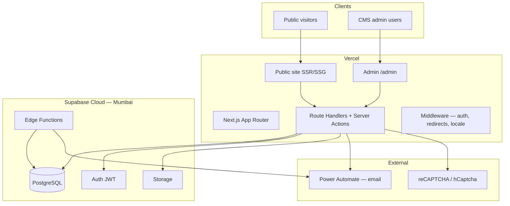

# Technical Architecture — CCSHAU Website (Option B)

**Phase:** 2 | **Version:** 1.0 | **Date:** 23 June 2026  
**UI baseline:** Option B — Agri Future (`future` component variant)  
**Stack:** Next.js 14+ · Supabase · Vercel · Power Automate

---

## 1. System context



---

## 2. Application layers

| Layer | Technology | Responsibility |
|-------|------------|----------------|
| **Public UI** | Next.js App Router, React Server Components | Homepage, news, tenders, pages — Option B design |
| **Admin UI** | Next.js `/admin/*` | CMS dashboards, forms, media picker |
| **API** | Server Actions + Route Handlers | All writes, validation, RBAC, audit |
| **Auth** | Supabase Auth | Admin login only; JWT validated server-side |
| **Data** | Supabase PostgreSQL | Normalized `ccshau_*` schema with RLS |
| **Files** | Supabase Storage | PDFs, images, tender docs, media |
| **Email** | Power Automate HTTP triggers | Transactional email (no direct SMTP) |
| **Jobs** | Edge Functions + `pg_cron` | Archive expired tenders/news |
| **Deploy** | Vercel + GitHub Actions | App CI/CD; Supabase CLI for migrations |

### Key principle

Admin CMS **writes never use the browser Supabase client with service role**. All mutations go through Next.js server code using `SUPABASE_SERVICE_ROLE_KEY` (server-only env). Public reads use SSR with optimized queries; RLS provides defense in depth for any direct PostgREST access.

---

## 3. Route structure

```
apps/web/src/app/
├── (public)/                    # Phase 4 — production routes
│   ├── page.tsx                 # Home (promoted from /design/option-b)
│   ├── news/
│   ├── tenders/
│   ├── circulars/
│   ├── downloads/
│   ├── media/
│   ├── contact/
│   └── [...slug]/               # CMS pages
├── admin/                       # Phase 3 — protected
│   ├── layout.tsx               # Auth guard
│   ├── dashboard/
│   ├── pages/
│   ├── news/
│   ├── tenders/
│   ├── media/
│   └── settings/
├── api/
│   ├── health/
│   ├── auth/                    # login, logout, captcha verify
│   ├── feedback/                # public form submit
│   ├── search/
│   └── webhooks/                # optional Power Automate callbacks
├── design/                      # Phase 1 prototypes (retained for reference)
└── middleware.ts                # Auth, redirects, locale
```

---

## 4. Security model

| Control | Implementation |
|---------|----------------|
| HTTPS | Vercel + Supabase enforced TLS |
| Admin auth | Supabase Auth email/password + server session validation |
| CAPTCHA | Verify on `POST /api/auth/login` before credential check |
| Lockout | `ccshau_login_attempts` — 5 failures → lock + Power Automate alert |
| RBAC | `ccshau_user_roles` + middleware + Server Action guards |
| RLS | Enabled on all `ccshau_*` tables |
| Service role | Server env only — never `NEXT_PUBLIC_*` |
| Audit | `ccshau_audit_logs` on login and every CMS write |
| Input validation | Zod schemas on all API inputs |
| File upload | MIME whitelist, size limits, server-side upload to Storage |
| CSRF | Built into Next.js Server Actions |

See `docs/phase-0/rbac-matrix.md` for role permissions.

---

## 5. Bilingual architecture

| Approach | Detail |
|----------|--------|
| **Storage** | Separate columns: `title_en`, `title_hi`, `content_en`, `content_hi` |
| **UI toggle** | `LanguageProvider` (Phase 1) → cookie `ccshau_lang` in middleware |
| **Routing** | Primary: query `?lang=hi` or path prefix `/hi/*` (Phase 4 decision) |
| **Fallback** | If Hindi field empty, display English |
| **Fonts** | Noto Sans + Noto Sans Devanagari (already in layout) |
| **Search** | FTS on combined `search_vector` with language-weighted fields |

---

## 6. Search architecture

**Phase 4 v1:** PostgreSQL full-text search (`tsvector` + GIN index) on:

- `ccshau_pages`
- `ccshau_news`
- `ccshau_tenders`
- `ccshau_circulars`
- `ccshau_downloads`

Updated via trigger `ccshau_update_search_vector()` on insert/update.

**Optional scale-up:** Meilisearch index synced on publish events (not in initial build).

---

## 7. Scheduled jobs

| Job | Schedule | Handler |
|-----|----------|---------|
| Archive expired tenders | Daily 00:30 IST | `ccshau_archive_expired_tenders()` or Edge Function |
| Archive expired news/notices | Daily 00:45 IST | `ccshau_archive_expired_news()` |
| Reindex search (if needed) | Weekly | Maintenance script |

---

## 8. Environment variables

| Variable | Scope | Purpose |
|----------|-------|---------|
| `NEXT_PUBLIC_SUPABASE_URL` | Client + server | Supabase project URL |
| `NEXT_PUBLIC_SUPABASE_ANON_KEY` | Client + server | Public anon key (RLS-bound reads) |
| `SUPABASE_SERVICE_ROLE_KEY` | **Server only** | Admin CMS writes |
| `POWER_AUTOMATE_*_URL` | Server only | Email flow HTTP triggers |
| `POWER_AUTOMATE_WEBHOOK_SECRET` | Server only | Verify incoming/outgoing |
| `CAPTCHA_SECRET_KEY` | Server only | CAPTCHA verification |
| `NEXT_PUBLIC_CAPTCHA_SITE_KEY` | Client | CAPTCHA widget |

See `apps/web/.env.example`.

---

## 9. CI/CD pipeline

```
Push to main
  → GitHub Actions: lint, typecheck, build
  → Vercel preview (PR) / production (main)
  → Supabase migrations: manual `supabase db push` or CI step with service token
```

Existing workflow: `.github/workflows/ci.yml`

---

## 10. RFP compliance mapping

| RFP requirement | This architecture |
|-----------------|-------------------|
| React.js responsive frontend | Next.js (React) + Option B UI |
| PostgreSQL database | Supabase PostgreSQL |
| Secure modular API | Server Actions + Route Handlers |
| JWT authentication | Supabase Auth |
| CAPTCHA + RBAC | App-layer + `ccshau_*` tables |
| File management | Supabase Storage |
| Audit logs | `ccshau_audit_logs` |
| Cloud hosting | Vercel + Supabase Cloud |
| Weekly backups | Supabase automated backups |
| Source code handover | Git repo + SQL migrations + env docs |

---

## 11. Approval

| Role | Name | Date | Approved |
|------|------|------|----------|
| Tech Lead | | | ☐ |
| Incharge, Computer Section | | | ☐ |
