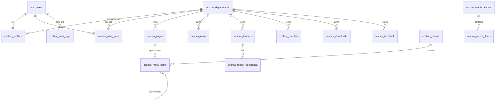

# Database Schema — CCSHAU

**Phase:** 2 | **Version:** 1.0 | **Prefix:** `ccshau_` (documented as `CCSHAU_`)  
**Migrations:** `20260623120000_phase_2_schema.sql`, `20260623130000_phase_2_rls_functions.sql`

---

## 1. Entity relationship overview

---

## 2. Enums

| Enum | Values |
|------|--------|
| `ccshau_content_status` | `draft`, `pending_review`, `published`, `archived` |
| `ccshau_user_role` | `super_admin`, `dept_admin`, `editor`, `viewer` |
| `ccshau_menu_location` | `header`, `footer`, `quick_links` |
| `ccshau_notice_type` | `news`, `notice`, `corrigendum`, `cancellation` |
| `ccshau_tender_status` | `draft`, `open`, `closed`, `archived` |
| `ccshau_feedback_status` | `new`, `in_progress`, `resolved`, `closed` |
| `ccshau_media_album_type` | `photo`, `video`, `press_release`, `event` |
| `ccshau_audit_action` | `login`, `logout`, `create`, `update`, `delete`, `publish`, `unpublish`, `upload`, `archive`, `lockout` |

---

## 3. Core tables

### `ccshau_departments`

Organizational units for RBAC and content ownership.

| Column | Type | Notes |
|--------|------|-------|
| `id` | uuid PK | |
| `slug` | text UNIQUE | e.g. `registrar`, `research` |
| `name_en`, `name_hi` | text | Bilingual names |
| `is_active` | boolean | |
| `sort_order` | int | Display order |
| `created_at`, `updated_at` | timestamptz | |

### `ccshau_profiles`

Extends `auth.users` for admin display and primary department.

| Column | Type | Notes |
|--------|------|-------|
| `id` | uuid PK FK → `auth.users` | CASCADE delete |
| `display_name` | text | |
| `email` | text | Denormalized for admin lists |
| `department_id` | uuid FK → departments | Primary department |
| `is_active` | boolean | Disable without deleting auth user |
| `last_login_at` | timestamptz | |
| `created_at`, `updated_at` | timestamptz | |

### `ccshau_user_roles`

Many-to-many: users can hold roles per department.

| Column | Type | Notes |
|--------|------|-------|
| `id` | uuid PK | |
| `user_id` | uuid FK → `auth.users` | |
| `role` | `ccshau_user_role` | |
| `department_id` | uuid FK nullable | NULL = global (super_admin) |
| UNIQUE | `(user_id, role, department_id)` | |

---

## 4. Content tables

### `ccshau_pages`

CMS-managed static/dynamic pages.

| Column | Type | Notes |
|--------|------|-------|
| `id` | uuid PK | |
| `slug` | text UNIQUE | URL segment |
| `title_en`, `title_hi` | text | |
| `content_en`, `content_hi` | text | HTML/JSON from rich editor |
| `excerpt_en`, `excerpt_hi` | text | Optional |
| `meta_title`, `meta_description` | text | SEO |
| `department_id` | uuid FK | |
| `content_owner_id` | uuid FK → profiles | |
| `parent_id` | uuid FK self | Hierarchy |
| `status` | `ccshau_content_status` | |
| `published_at` | timestamptz | |
| `featured_image_path` | text | Storage path |
| `sort_order` | int | |
| `search_vector` | tsvector | FTS |
| `created_by`, `updated_by` | uuid | |
| `created_at`, `updated_at` | timestamptz | |

### `ccshau_menus` / `ccshau_menu_items`

Navigation management (header, footer, quick links).

**menus:** `id`, `location` (enum), `name_en`, `name_hi`, `is_active`

**menu_items:** `id`, `menu_id`, `parent_id`, `label_en`, `label_hi`, `href`, `page_id` (optional FK), `sort_order`, `open_in_new_tab`, `is_active`

### `ccshau_news`

News, notices, corrigenda, cancellations.

| Column | Type | Notes |
|--------|------|-------|
| `id`, `slug` | uuid, text UNIQUE | |
| `title_en`, `title_hi`, `body_en`, `body_hi` | text | |
| `notice_type` | enum | news / notice / corrigendum / cancellation |
| `category` | text | e.g. `examination`, `admission` |
| `department_id`, `content_owner_id` | uuid | |
| `status` | `ccshau_content_status` | |
| `published_at`, `expires_at` | timestamptz | Auto-archive after expiry |
| `is_featured`, `is_pinned` | boolean | Homepage highlights |
| `attachment_paths` | jsonb | `[{path, name, size}]` |
| `search_vector` | tsvector | |
| `created_by`, `updated_by`, timestamps | | |

### `ccshau_circulars`

| Column | Type | Notes |
|--------|------|-------|
| `circular_number` | text | Official reference |
| `title_en`, `title_hi` | text | |
| `file_path`, `file_name`, `file_size` | text, text, bigint | Storage |
| `department_id`, `status` | | |
| `published_at`, `archived_at` | timestamptz | |
| `search_vector` | tsvector | |

### `ccshau_tenders` / `ccshau_tender_corrigenda`

**tenders:** `tender_number`, `title_en/hi`, `description_en/hi`, `category`, `department_id`, `status` (tender_status enum), `published_at`, `closing_date`, `archived_at`, `document_paths` (jsonb), `search_vector`

**corrigenda:** `tender_id` FK, `title`, `description`, `file_path`, `published_at`

### `ccshau_downloads`

Document repository with versioning.

| Column | Type | Notes |
|--------|------|-------|
| `title_en`, `title_hi` | text | |
| `category` | text | |
| `file_path`, `file_name`, `file_size`, `mime_type` | | |
| `version` | text | e.g. `2024-v2` |
| `department_id`, `status` | | |
| `download_count` | bigint | Increment on public download |
| `search_vector` | tsvector | |

### `ccshau_media_albums` / `ccshau_media_items`

**albums:** `slug`, `title_en/hi`, `album_type`, `event_date`, `department_id`, `cover_image_path`, `status`

**items:** `album_id`, `title_en/hi`, `media_type` (`image`|`video`), `storage_path`, `thumbnail_path`, `caption_en/hi`, `sort_order`

### `ccshau_banners`

Homepage / campaign banners.

| Column | Type | Notes |
|--------|------|-------|
| `title` | text | Admin label |
| `image_path`, `target_url`, `alt_text` | text | |
| `start_date`, `end_date` | timestamptz | Schedule |
| `priority` | int | Higher = first |
| `is_active` | boolean | |

### `ccshau_related_links`

Government and institutional links.

`title_en/hi`, `url`, `category`, `sort_order`, `is_external`, `is_active`

### `ccshau_feedback`

Public feedback submissions.

| Column | Type | Notes |
|--------|------|-------|
| `ticket_number` | text UNIQUE | Auto-generated `CCSHAU-YYYYMMDD-XXXX` |
| `category`, `department_id` | | |
| `submitter_name`, `email`, `phone` | text | |
| `subject`, `message` | text | |
| `status` | `ccshau_feedback_status` | |
| `admin_remarks` | text | |
| `ip_address`, `user_agent` | text | |
| `created_at`, `updated_at` | timestamptz | |

---

## 5. Security & support tables

### `ccshau_audit_logs`

| Column | Type | Notes |
|--------|------|-------|
| `user_id` | uuid nullable | NULL for system events |
| `action` | `ccshau_audit_action` | |
| `entity_type` | text | e.g. `news`, `tender` |
| `entity_id` | uuid | |
| `details` | jsonb | Change summary |
| `ip_address` | text | |
| `created_at` | timestamptz | Append-only |

### `ccshau_login_attempts`

| Column | Type | Notes |
|--------|------|-------|
| `email` | text | |
| `ip_address` | text | |
| `success` | boolean | |
| `attempted_at` | timestamptz | |

### `ccshau_url_redirects`

| Column | Type | Notes |
|--------|------|-------|
| `legacy_path` | text UNIQUE | Old URL path |
| `new_path` | text | New URL path |
| `redirect_type` | smallint | 301 or 302 |
| `is_active` | boolean | |
| `notes` | text | Migration reference |

---

## 6. Indexes (summary)

| Table | Index | Purpose |
|-------|-------|---------|
| All content | `status`, `department_id`, `published_at` | Admin filters |
| pages, news, tenders | GIN on `search_vector` | Full-text search |
| news | `expires_at` WHERE published | Archive job |
| tenders | `closing_date` WHERE open | Archive job |
| feedback | `ticket_number`, `status`, `created_at` | Admin inbox |
| login_attempts | `(email, attempted_at DESC)` | Lockout check |
| url_redirects | `legacy_path` WHERE active | Middleware lookup |

---

## 7. TypeScript constants

Use `Tables` and `Functions` from `apps/web/src/lib/database/names.ts` — never raw table name strings.

Types: `apps/web/src/lib/database/types.ts`

---

## 8. Seed data

Migration seeds core departments:

- `university-admin` — University Administration
- `registrar` — Registrar
- `research` — Directorate of Research
- `extension` — Directorate of Extension Education
- `academics` — Academics
- `examination` — Examination Branch

Menus are created empty; populated in Phase 3 CMS setup.
